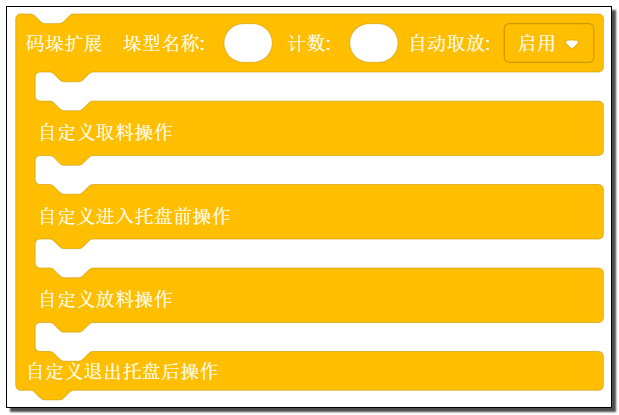
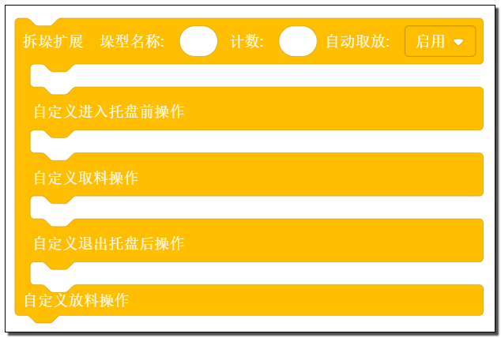

# 码垛工艺包 

**该仓库提供了 JAKA 码垛工艺包使用指南和示例程序。**

[English Readme](./README_EN.md)

码垛工艺包基于 JAKA AddOn 平台 2.0 开发。由“工艺包配置页面”和“码垛指令块”两部分组成。通过工艺包配置页面，用户可以轻松的对垛型和码垛相关参数进行配置，而“码垛指令块”则可以在JAKA APP编程页面中和其他指令块搭配编程，完成各种码垛的程序。

https://github.com/JakaCobot/Palletizers/assets/89619125/bdf118a8-320f-4ed2-9bda-902a6cc1d1ee

**基础码垛指令块**

**扩展码垛指令块**

**扩展拆垛指令块**

## 使用指南

[使用指南](https://github.com/JakaCobot/Palletizers/wiki/%E7%A0%81%E5%9E%9B%E5%B7%A5%E8%89%BA%E5%8C%85%E4%BD%BF%E7%94%A8%E6%8C%87%E5%8D%97)

## 插件信息

* 名称：Palletizers
* 版本：v1.8.2
* 描述：该 AddOn 适用于使用 JAKA 机器人进行码垛任务时使用。
* 兼容性：同时支持 JAKA 控制器 1.7.0 及 1.7.1 版本。

* 系统要求（1.7.0）：       
    控制器：v1.7.0.46 及以上  
    App：v1.7.0.24 及以上  
 
* 系统要求（1.7.1）：      
    控制器：v1.7.1.24_x64 以上  
    App：v1.7.1.24 及以上  
    JAKA-AddOn-Kit：v1.4 及以上 
    
        提示：JAKA-AddOn-Kit 版本号 与 System_AddOn 版本号一致。

## 安装指南

* 安装插件

1. 打开App-设置-系统设置-附加程序，点击右上角的“+”按钮，安装该插件。
2. 点击状态按钮运行插件。
   

    提示：使用 JAKA App 1.7.0.x 版本时，安装完成插件后，需手动重启 JAkA App 之后才能正常使用。

3. 成功之后可以在 App 编程页面的“扩展”指令栏中找到码垛指令块。
   

## 示例程序使用方式 

下载该仓库，在 demo 目录中可以找到程序压缩包，在 JAKA App 编程页面导入程序即可。

## 版本升级

兼容码垛工艺包 v1.5.3 及以上版本直接升级，按照下面的升级步骤，您将可以保留原有的垛型数据：

1. 使机器人处于下使能状态
2. 使码垛工艺包处于关闭状态
3. 上传新版本码垛工艺包
4. 重启 JAKA App ，如果是平板等移动设备，请清理 App 的缓存后再重启 App 。
5. 如果有，请替换程序中使用的老版本码垛指令块。

码垛工艺包v1.5.3 以下的版本不能兼容升级，请删除原有版本后再安装新版本。

## 选则托盘指令或码垛指令？   

托盘指令的优势在于对于各种简单排列的垛型可以快速完成示教而不需要用户坐标系和TCP。码垛指令的优势在于可以图形化的设置复杂垛型，并且帮助您管理码垛过程中的信号和负载切换。以及码垛指令可以将垛型储存下来，随时供您再次选择。
	
|    \  |  托盘指令  |  码垛指令  | 
|  ----  | ----  | ----  | 
|  TCP  | 不需要  | 需要  |   
|  托盘坐标系  | 不需要  | 需要  |   
|  复杂垛型  | 多条指令  | 一条指令  |   
|  自动切换负载  | 不支持  | 支持  |   
|  信号监控  | 不支持  | 支持  |   
|  垛型切换  | 不支持  | 支持  |   

## 问题及 BUG 反馈 

您可以在我们的 Github 仓库中提交 [issue](https://github.com/JakaCobot/Palletizers/issues) 和 [参与讨论](https://github.com/JakaCobot/Palletizers/discussions)。
