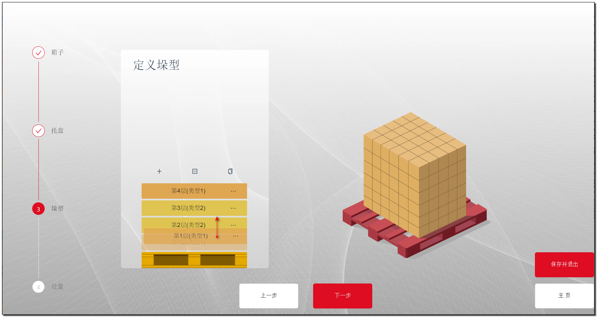
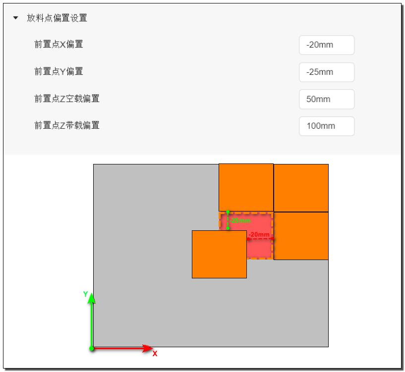
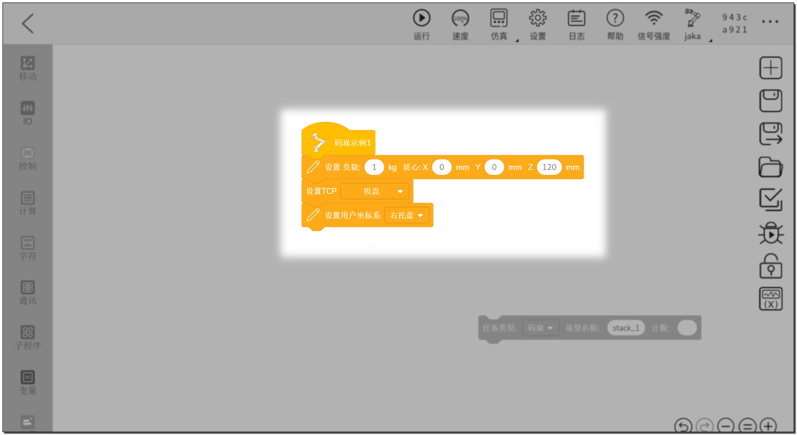

# 码垛工艺包
---
**该文档为码垛工艺包的使用说明手册，其主要步骤及图示基于 JAKA v1.7.1 版本控制器软件,与 1.7.0 可能存在一些差异，当有额外的步骤或注意事项时会在步骤下方指出。**

<!-- [English document](./en/README.md) -->
- [码垛工艺包](#码垛工艺包)
  - [插件信息](#插件信息)
  - [安装指南](#安装指南)
  - [使用指南](#使用指南)
    - [坐标系标定](#坐标系标定)
    - [创建垛型](#创建垛型)
    - [编辑程序](#编辑程序)
  - [进阶指南](#进阶指南)
  - [常见问题](#常见问题)
  - [版本升级](#版本升级)
  - [问题及 BUG 反馈](#问题及-bug-反馈)

## 插件信息

* 名称：Palletizers
* 版本：v1.7.1
* 作者：JAKA
* 描述：该 AddOn 适用于使用 JAKA 机器人进行码垛任务时使用。
* 兼容性：同时支持 JAKA 控制器 1.7.0 及 1.7.1 版本。

* 系统要求（1.7.0）：
    控制器：v1.7.0.46 及以上  
    App：v1.7.0.24 及以上  
 
* 系统要求（1.7.1）：
    控制器：v1.7.1.24 以上  
    App：v1.7.1.24 及以上  
    JAKA-AddOn-Kit：v1.4 及以上 

## 安装指南

* 安装插件

1. 打开App-设置-系统设置-附加程序，点击右上角的“+”按钮，安装该插件。
2. 点击状态按钮运行插件。
   

    提示：使用 JAKA App 1.7.0.x 版本时，安装完成插件后，需手动重启 JAkA App 之后才能正常使用。

3. 成功之后可以在 App 编程页面的“扩展”指令栏中找到码垛指令块。
   

## 使用指南    

### 坐标系标定

在开始使用码垛包之前，需要**标定托盘坐标系**和**标定吸盘（夹爪）工具坐标系** 。这一步的目的是建立托盘和夹爪的位置关系。

- 标定托盘坐标系  
  我们需要找到托盘的一个角来设置一个用户坐标系，作为这个托盘的托盘坐标系，通常找的是托盘定位的那一个角。这样做的好处是即使更换了托盘的尺寸，也无需重新标定。  

  在双托盘系统中，对称设置坐标系时，总会有一侧的坐标系Z轴是向下的（指向地面）。

    注意：托盘坐标系需要标定在托盘的表面，不是底面的角。

- 标定TCP  
   
  如下图所示，需将吸盘（夹爪）示教到抓取位置后，此时箱子表面中心点为工具坐标系的原点，箱子的宽度方向为 X 方向，箱子的长度方向为 Y 方向。

### 创建垛型

从指令栏中拖出一条码垛指令块，点击指令块即可进入垛型管理页面。

-点击“创建新垛型”，输入垛型名称创建一个新的垛型。

创建完成后，我们将通过 4 个步骤来定义垛型。

**步骤 1 ：定义箱子**  

输入箱子的长宽高及重量，在码垛过程中会根据该重量调整负载。

**步骤 2 ：定义托盘**  

选择预设的标准托盘尺寸，或者输入自定义的托盘长宽高。   
- 托盘用户坐标系 Z 轴反转  
  是否需要勾选，取决于托盘坐标系的 Z 轴是否指向地面。如果不明白，可以参考前面的托盘坐标系标定小节。

**步骤 3 ：定义垛型**  

垛型定义页面支持添加新的层型和垫层。

点击 + 号按钮，新建一种层型，点击后进入层型编辑页面。

该页面中，粉红色区域代表托盘，点击新建箱子会在托盘旁生成一个新的箱子。

- 位置调整   
您可以在坐标栏中输入具体数值来调整箱子的位置，也可以直接拖拽箱子到托盘上想要的位置，双击箱子调整旋转角度。
- 删除     
如果您想删除多余的箱子，首先需要选中它。
- 取消   
点击取消将不会保存您刚才做过的更改，直接返回垛型页面。    
- 保存并退出   
点击保存并退出，会保存刚才的更改。

    提示：码垛时会按照箱子上的 Id 由小到大的顺序进行。

当编辑完所有类型的层后，可以通过复制层来快速完成整个垛型。

当您想调整垛型中层的顺序时，也可以简单的通过拖拽完成。

**步骤 4 ：码垛参数设置**  

码垛参数设置部分内容较多，主要包含了“信号设置”、“关键点位设置”、“抬升系数设置”、“放料偏置设置”、“延时设置”、和“运动设置” 6 个部分。其中只有“关键点设置”中的`箱子取料点`和`托盘入口点`是必须设置的，其余的参数可以根据实际需要进行配置和调整。

**信号设置**
以下所有的输入信号（DI）均为高电平生效，根据实际的信号使用情况进行勾选和配置。

- 箱子到位：在取料点会持续等待该信号，高电平时继续运行。
- 箱子缺失：当箱子到位信号为低电平时，输出高电平信号。
- 托盘到位：在到达托盘入口点后，持续等待该信号，高电平时继续运行。
- 托盘缺失：当托盘到位信号为低电平时，输出高电平信号。
- 抓取检测：取料完成后持续等待该信号，高电平时继续运行。
- 夹爪信号：取料时输出高电平信号，放料时输出低电平信号。
- 托盘重置：用于将托盘完成 DO 信号置为低电平。
- 托盘完成：在到达托盘入口点后，持续等待该信号，低电平（码垛未完成）时继续运行。当码垛包内部计数等于本次码垛的计数时，输出高电平信号。

**关键点设置**

    提示：   
    在进行点位设置前，请先确保机器人处于上使能状态。如果需要切换到主页进行上使能操作，请务必先点击保存并退出，以免导前面的设置全部丢失。

    注意：    
    在JAKA控制器软件 v1.7.0.x 版本上使用时，未上使能移动机器人会自动跳转至主页，导致前面的数据未保存，因此一定义要注意保存。

-开始位置至箱子取料点

这里可以设置一系列过渡点，从进入码垛程序前程序中最后一个点开始，到箱子取料点上方结束。可以添加任意多个点，也可以不添加，根据实际环境来决定。

- 箱子取料点
  
  如图所示，将吸盘（夹爪）示教至吸（抓）取箱子的位置，保存为箱子取料点。注意此时 TCP 的 X 轴应指向箱子的宽度方向。

    提示：当使用拆垛指令时，该点实则为放料点。

- 箱子取料点至托盘入口点
  
这里可以设置一系列过渡点，从箱子取料点上方开始，到托盘入口点结束。可以添加任意多个点，也可以不添加，根据实际环境来决定。

- 托盘入口点

  托盘入口点是一个公共过渡点，是进入托盘前的最后一个点，也是退出托盘后的第一个点。这个点的高度会根据垛的高度实时调整，但最低点永远都将是您设置的位置。一般来说这个点应该设置在托盘外部，但也可以根据实际情况进行测试调整。

设置完成后会看到点位后面的图标变为绿色的对勾。

**抬升系数设置**

抬升系数的作用就是决定在取料前（空载）、取料后（带载）、放料前（带载）和放料后（空载）分别应该升高到什么位置。系数单位是 mm ，码垛包会自动将这个系数加到取料点和放料点的位置上，生成取放料的前置点和后置点。

**放料前置点偏置**

设置放料前置点偏置参数，保证箱子可以安全的放置到位。默认值为0，即在放料位置上方垂直下降。

    注意：如果设置了偏置参数，请确保箱子的摆放顺序是合理的，避免碰撞。

**延时设置**

- 取料延时时间：开始吸取箱子后，延时的时间。
- 放料延时时间：放置箱子后，延时的时间。
- 箱子到位延时时间：箱子到位信号就绪后，延时的时间。

**运动设置**

- 圆弧过渡：码垛过程中所有运动段间的圆弧过渡参数。
   
      提示：由于信号等待、socket 通讯会打断圆弧过渡的原因，部分运动段无法进行连续运动和圆弧转接。

- 空载速度：机器人末端没有箱子时的速度。
- 带载速度：机器人末端有箱子时的速度。  
- 取放料前减速距离：在取放料点上方某个高度开始降速运动。

      提示：   
      * 当这个距离大于取料前置点的高度时，取料前置点抬高。
      * 当大于放料前置点时，减速距离等于放料前置点的高度。

- 取放料前减速至：当到达上述设置的减速距离时，降速运动的目标速度。

    

### 编辑程序

到此为止，我们已经完成了坐标系设置、垛型创建和码垛参数配置。接下来可以开始编辑程序的部分。以下示例程序将展示核心的四个部分，用户可以根据实际场景进行扩展和完善。

**初始化负载及坐标系**

为了使码垛程序能正确的切换负载，我们需要初始化负载，此时的重量为末端工具的重量，偏置为码垛时工具的TCP中心即可。同时需要切换到正确的坐标系，使码垛程序知道工具和托盘的位置。

    提示：初始化负载可以有效避免因中断程序导致到负载持续叠加。

**构建码垛循环**

为了使机器人可以一个接一个的将箱子码放在托盘上，需要使用循环逻辑来重复执行码垛指令。

**码垛计数变量**

上一步骤中，虽然我们使用循环指令使的码垛指令可以重复执行，但此时码垛指令并不知道需要码放第几个箱子。因此需要我们在`计数`输入框内输入一个数值，用来指定码放第几个箱子。

    提示：计数从 1 开始。

这里使用系统变量作为计数输入，这样可以在程序循环中对该值进行累加，从而一个接一个的进行码垛。同时系统变量拥有持续保存的特性，可以在程序停止后再次恢复码垛。

使用该变量并添加累加的程序。

**码垛完成检测**

这里给出两种码垛完成的处理方案，一种是通过数量判断，并结束程序。另一种是通过托盘完成信号和托盘重置信号实现，完成后通过托盘重置信号继续码垛。

- 数量比较
  

- 信号检测
  

**双托盘系统**

在此基础上，我们可以轻松的构建出双托盘的码垛程序。

## 进阶指南

**扩展指令**
 
当某些情况下，单行码垛指令无法完成任务时，可以使用扩展指令。

例如：   
- 夹爪或吸盘需要使用多个信号或者通讯的方式进行控制
- 需要在码垛过程中控制升降轴
- 取放料时需要自定义一些动作等
- ···

      提示：
        扩展指令只是将单行的指令拆成了几个部分，留出一些可以让用户添加自定义程序的部分。核心的程序框架仿照上一小节即可。

    注：    
    在 JAKA 控制器软件版本 v1.7.0.x 上，扩展指令的显示略有区别，对应区域的描述文字位于区域上方，其他并无区别。

- 自动取放的说明

启用时的运行顺序： ··· -> 取料前置点 -> 取料点 -> 用户插入的自定义程序 -> 取料后置点 -> ···

禁用时的运行顺序： ··· -> 取料前置点 -> 用户插入的自定义程序  -> ···

扩展拆垛指令同理，这里不做另外的说明。

    提示：如果不能理解，实际使用一下试试！

**垫层**

当码垛任务需要添加垫层时，可以在定义垛型页面添加垫层，并设置垫层的厚度。同样的垫层也可以像层一样拖动，快速的调整位置。

同时，一旦垫层被添加在垛型中，设置页面的“信号设置”和“关键点设置”都会出现相应的设置。

- 垫层到位：在垫层取料点会持续等待该信号，高电平时继续运行。
- 垫层缺失：当垫层到位信号为低电平时，输出高电平信号。
- 开始位置至垫层取料点：同开始位置至箱子取料点类似，只是到垫层取料点上方结束。
- 垫层取料点：同取料点类似，前置点后后置点与取箱子时的高度一致。
- 垫层取料点至托盘入口点：同箱子取料点至托盘入口点类似。
- 托盘入口点（垫层）：同托盘入口点类似，在执行垫层码放时生效。
- 垫层放料点：
  用户需要示教一个垫层的放料位置，只需要关注 x 和 y 的位置即可，z 的值程序会根据垫层的位置和当前的垛型自动计算

    提示：添加垫层后，每一个垫层都会占用一个码垛计数。例如第一层有 10 个箱子，然后是一个垫层，此时当指令块上的计数等于 11 时，将执行垫层的码放。

## 常见问题

**1. 在托盘上方放料时，在空中就释放了箱子或者压箱子。**
  
 - 托盘坐标系设置错误，位于托盘上方或下方。
 - 箱子高度设置错误   
  解决方案：检查设置并修正。

**2. 箱子旋转后，放料位置偏移。**
   
- 吸取箱子时工具 TCP 中心没有与箱子中心重合。   
解决方案：重新示教 TCP 或调整抓取位置。

**3. 垛型管理页面无法打开**   
   
- JAKA App 当前存在此类 Bug，可能导致页面长时间卡在页面加载中。   
解决方案：重启 App

- 使用 VPN / VPS 时无法加载该页面。    
解决方案：关闭 VPN / VPS 连接。

**4. 程序无法保存** 

- 码垛工艺包没有启动   
解决方案：在附加程序页面启动码垛工艺包。

- 指令块上的计数框内没有填入数字或变量。   
解决方案：填入数字或变量

- 指令块上填入的垛型名称在数据库中没有找到。
解决方案：检查是否存在该垛型，并填入正确的名称。

- 垛型中不存在层和箱子。   
解决方案：检查垛型是否存在层，层中是否存在箱子。

**5. 垛型中的一些参数丢失** 

- 使用了新的指令块
解决方案：为了更好的兼容和灵活性，码垛工艺包中，不是所有参数都与垛型绑定保存，有一些是保存在指令块上的，当使用了新的指令块时这些参数就需要重新设置。

    保存在指令块上的参数：
      * 托盘用户坐标系 Z 轴反转
      * 所有信号设置
      * 所有点位设置

## 版本升级

兼容码垛工艺包 v1.5.3 及以上版本直接升级，按照下面的升级步骤，您将可以保留原有的垛型数据：

1. 使机器人处于下使能状态
2. 使码垛工艺包处于关闭状态
3. 上传新版本码垛工艺包

码垛工艺包v1.5.3 以下的版本不能兼容升级，请删除原有版本后再安装新版本。

## 问题及 BUG 反馈 

您可以在我们的 Github 仓库中提交 issue 和参与讨论。

Github：https://github.com/JakaCobot/Palletizers